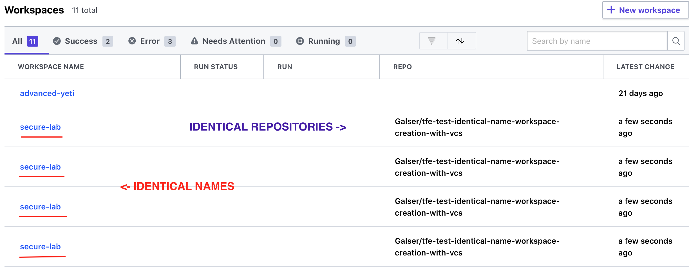

# tfe-test-identical-name-workspace-creation-with-vcs
Repo to test possibility of creating in TFE two (2) workspaces with IDENTICAL names (which should not be possible according to our documentation) - with VCS settings defined

Based on : https://github.com/Galser/tfe-test-identical-name-workspace-creation

# Hypothesis

According to our manuals here: https://www.terraform.io/docs/cloud/workspaces/creating.html :

> Each new workspace needs a unique name and needs to know where its Terraform configuration will come from.

And from here : 

> Workspace names need to be 90 characters or less and can only include letters, numbers, -, and _.

> The best way to make names that are both unique and useful is to combine the workspace's most distinguishing attributes in a consistent order. Attributes can be any defining characteristic of a workspace — such as the component being managed, the environment it runs in, and the region it is provisioned into.

So there is no **BOLD** requirement for it to be unique, yet normally when you are trying to create a workspace with the same name it fails.

While we have a screenshot : 



One of our engineers suggested (*thank you Top!*) - that this can be possible in a situation when workspaces have VCS settings block defined in resource  `tfe_workpace` . 

# Test

Providing the code in [main.tf](main.tf) include the following piece for workspaces creation : 

```Terraform
...
# Creating workspace(s) 1 
resource "tfe_workspace" "ws-test-main" {
  count        = local.resources_count
  name         = local.workspace_to_create
  organization = var.org
  vcs_repo {
    identifier         = var.repo_identifier
    ingress_submodules = false
    oauth_token_id     = var.oauth_token
  }
}


# Creating workspace(s) 2
resource "tfe_workspace" "ws-test-doppelganger" {
  count        = local.resources_count
  name         = local.workspace_to_create
  organization = var.org
  vcs_repo {
    identifier         = var.repo_identifier
    ingress_submodules = false
    oauth_token_id     = var.oauth_token
  }
}
...
```
> I've left away variables and provider definition

We defined **TFE_TOKEN** env variable with the value of the freshly created API TOKEN for the used TFE instance, as well **as oauth_token_id** - corresponding to the appropriate VCS connection - that **should be already defined in your testing TFE** and have access to the `repo_identifier` repository.

Plan (*successfully*) goes like this : 

```Terraform
An execution plan has been generated and is shown below.
Resource actions are indicated with the following symbols:
  + create

Terraform will perform the following actions:

  # random_pet.workspace will be created
  + resource "random_pet" "workspace" {
      + id        = (known after apply)
      + length    = 2
      + separator = "-"
    }

  # tfe_workspace.ws-test-doppelganger[0] will be created
  + resource "tfe_workspace" "ws-test-doppelganger" {
      + auto_apply            = false
      + external_id           = (known after apply)
      + file_triggers_enabled = true
      + id                    = (known after apply)
      + name                  = (known after apply)
      + operations            = true
      + organization          = "migrotest"
      + queue_all_runs        = true
      + terraform_version     = (known after apply)

      + vcs_repo {
          + identifier         = "Galser/tfe-test-identical-name-workspace-creation-with-vcs"
          + ingress_submodules = false
          + oauth_token_id     = "ot-XBbeoMfT8JAtf8yN"
        }
    }
...
Plan: 5 to add, 0 to change, 0 to destroy.
...
```

You can check full plan log here : [terraform_plan.md](terraform_plan.md)

And apply, also goes fine, creating 4 (four)! workspaces with identical names : 

```bash
terraform apply
random_pet.workspace: Refreshing state... [id=secure-lab]

An execution plan has been generated and is shown below.
Resource actions are indicated with the following symbols:
  + create

Terraform will perform the following actions:

  # tfe_workspace.ws-test-doppelganger[0] will be created
  + resource "tfe_workspace" "ws-test-doppelganger" {
      + auto_apply            = false
      + external_id           = (known after apply)
      + file_triggers_enabled = true
      + id                    = (known after apply)
      + name                  = "secure-lab"
      + operations            = true
      + organization          = "migrotest"
      + queue_all_runs        = true
      + terraform_version     = (known after apply)

      + vcs_repo {
          + identifier         = "Galser/tfe-test-identical-name-workspace-creation-with-vcs"
          + ingress_submodules = false
          + oauth_token_id     = "ot-XBbeoMfT8JAtf8yN"
        }
    }

  # tfe_workspace.ws-test-doppelganger[1] will be created
  + resource "tfe_workspace" "ws-test-doppelganger" {
      + auto_apply            = false
      + external_id           = (known after apply)
      + file_triggers_enabled = true
      + id                    = (known after apply)
      + name                  = "secure-lab"
      + operations            = true
      + organization          = "migrotest"
      + queue_all_runs        = true
      + terraform_version     = (known after apply)

      + vcs_repo {
          + identifier         = "Galser/tfe-test-identical-name-workspace-creation-with-vcs"
          + ingress_submodules = false
          + oauth_token_id     = "ot-XBbeoMfT8JAtf8yN"
        }
    }

  # tfe_workspace.ws-test-main[0] will be created
  + resource "tfe_workspace" "ws-test-main" {
      + auto_apply            = false
      + external_id           = (known after apply)
      + file_triggers_enabled = true
      + id                    = (known after apply)
      + name                  = "secure-lab"
      + operations            = true
      + organization          = "migrotest"
      + queue_all_runs        = true
      + terraform_version     = (known after apply)

      + vcs_repo {
          + identifier         = "Galser/tfe-test-identical-name-workspace-creation-with-vcs"
          + ingress_submodules = false
          + oauth_token_id     = "ot-XBbeoMfT8JAtf8yN"
        }
    }

  # tfe_workspace.ws-test-main[1] will be created
  + resource "tfe_workspace" "ws-test-main" {
      + auto_apply            = false
      + external_id           = (known after apply)
      + file_triggers_enabled = true
      + id                    = (known after apply)
      + name                  = "secure-lab"
      + operations            = true
      + organization          = "migrotest"
      + queue_all_runs        = true
      + terraform_version     = (known after apply)

      + vcs_repo {
          + identifier         = "Galser/tfe-test-identical-name-workspace-creation-with-vcs"
          + ingress_submodules = false
          + oauth_token_id     = "ot-XBbeoMfT8JAtf8yN"
        }
    }

Plan: 4 to add, 0 to change, 0 to destroy.


Warning: Version constraints inside provider configuration blocks are deprecated

  on main.tf line 35, in provider "tfe":
  35:   version  = "~> 0.15.0"

Terraform 0.13 and earlier allowed provider version constraints inside the
provider configuration block, but that is now deprecated and will be removed
in a future version of Terraform. To silence this warning, move the provider
version constraint into the required_providers block.

Do you want to perform these actions?
  Terraform will perform the actions described above.
  Only 'yes' will be accepted to approve.

  Enter a value: yes

tfe_workspace.ws-test-main[0]: Creating...
tfe_workspace.ws-test-doppelganger[1]: Creating...
tfe_workspace.ws-test-main[1]: Creating...
tfe_workspace.ws-test-doppelganger[0]: Creating...
tfe_workspace.ws-test-main[0]: Creation complete after 2s [id=ws-paW84yHtFJmkPQob]
tfe_workspace.ws-test-doppelganger[0]: Creation complete after 2s [id=ws-pKF9Npc2ZsEEt4P6]
tfe_workspace.ws-test-main[1]: Creation complete after 2s [id=ws-KvDTvLzHb58u47Ph]
tfe_workspace.ws-test-doppelganger[1]: Creation complete after 2s [id=ws-HRy4t4GJ5pX7aKcj]

Apply complete! Resources: 4 added, 0 changed, 0 destroyed.
```

Now,  this is interesting..it should be failing, in theory with error : 

```
Error: Error creating workspace XXX for organization YYYY : invalid attribute

Name has already been taken
```

And that's not happening.

So now we have, from above `apply` run - 4 workspaces with the identical name `secure-lab`, and whenever we pressing on ANY of them in UI, we always going to get the same workspace with id "**ws-HRy4t4GJ5pX7aKcj**" (via link https://tfe-migtest-2.guselietov.com/app/migrotest/workspaces/secure-lab/ ) 

Let's do some tests in Rails console of TFE : 

- Login via SSH to TFE instance
- Run Rails console : `docker exec -it ptfe_atlas bash /usr/bin/init.sh /app/scripts/wait-for-token -- bash -i -c 'cd /app && ./bin/rails c'`
- Select all the workspaces with name "secure-lab" : `irb(main):002:0> Workspace.select(:external_id, :name).all.where(:name => 'secure-lab')`
- Example of output : 

```
=> #<ActiveRecord::Relation 
[#<Workspace id: nil, name: "secure-lab", external_id: "ws-HRy4t4GJ5pX7aKcj">, 
#<Workspace id: nil, name: "secure-lab", external_id: "ws-paW84yHtFJmkPQob">, 
#<Workspace id: nil, name: "secure-lab", external_id: "ws-KvDTvLzHb58u47Ph">, 
#<Workspace id: nil, name: "secure-lab", external_id: "ws-pKF9Npc2ZsEEt4P6">]>
```

And here we can see that we do have 4 workspaces with distinct different IDs (*last column - external_id*), but 2-nd to 4-th are not accessible via UI. 

It looks like a bug.

# Conclusion

For the TFE versions: v202005-2 and v202012-2 and TF versions ranging from v 0.12.24 up to v 0.13.5 the behavior is the same, reproduce both by me and our customer's engineer. 


# TODO

- [x] import old code
- [x] add VCS settings
- [x] test
- [x] conclusion


Test of the creation of 2 or more identical workspaces in TFE, provided that we have VCS settings defined.
